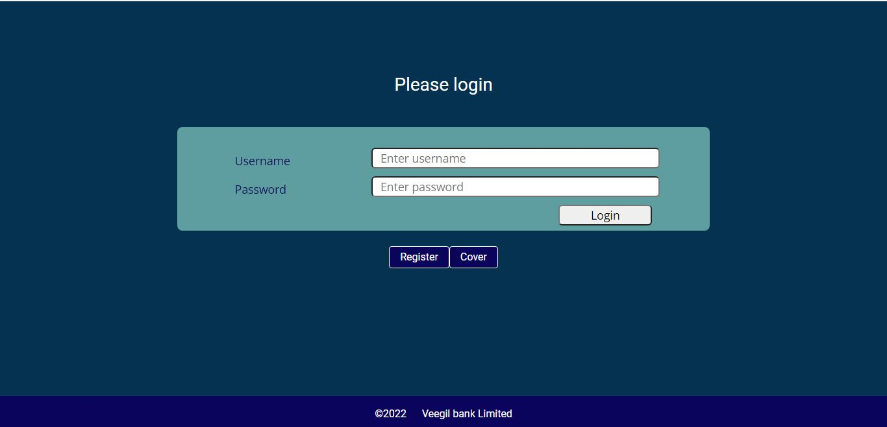

## Veegil Media Full-Stack Webdeveloper Test Project

## Online Banking System

## Built by NNAMDI EMELU

This project is the implementation of an online/internet banking system. It consists of a backend API endpoint as well as a simple but user-friendly frontend. The API endpoints are built with Node.JS and connected to a cloud-based MongoDB database. The front end is built with an EJS template engine and Bootstrap. All static files are stored in the public folder. This project defines two mongoose models, User, and Transaction, with the appropriate fields and data validations as can be seen in a real-life banking application. The Transaction model has a referential relationship with the records field in the User model. From the front-end, you make queries to the database through the API endpoints when using all the banking features. During user registration, supplied phone number is automatically the account number. User passwords are encrypted using bcrypt before storing them in the database. Important routes are protected using JWT token authentication. The token is created each time a user logs in and it is stored in the HTTP-Only cookies in the user's browser for about 3 hours. This token is used to create a middleware that protects these important routes from unauthorized access. The protected routes are;

- /action routes - which grants access to deposit or withdrawal.
- /balance - for checking balance.
- /transfer - to make transfer.
- /trans-details - to chech user transaction history.
- /logoutUser - to log out a user.

Each time a user tries to perform an action that has to do with these routes, the middleware validates the generated user token, if successful, it will grant access otherwise, access will be denied with the message -Authorization fail-. This project has all the basic features of a real banking application. During registration, the user must upload his profile picture which is stored in the MongoDB database for the sake of this project.

When the user logs in, and on successful authentication and validation, the user dashboard is shown. The user's full name, Account number, and profile picture are loaded as well.

However, there is still room for improvement. As time goes on, I will add more features and improve the existing code base and user interface design. Full responsiveness will also be implemented with time.
Admin page to view all transactions, delete and edit each user profile, see each users' transaction details among others will be added with time.
Take note, UI for this first version is purely for desktop or large screen view.

## Features

- New users can sign up or register.
- Existing users can log in.
- Signed-in users can make deposits and withdrawals.
- Signed in user can see his/her transaction details.
- User can transfer money to another customer in the bank.
- User can check his balance.
- Unique validations implemented for email, phone number, and username.
- Phone number fields (account number) will accept only numbers.
- Username must be in the range of 8 - 15 characters only.
- User can upload a profile image.

## Preview

## Cover Page


## Login Page



## Registration Page


## User Dashboard Page


## ENDPOINTS SUMMARY

| Method |         Endpoint          | Public |              Action               |
| :----: | :-----------------------: | :----: | :-------------------------------: |
|  POST  |   /api/bank/createUser    |  True  |        Register a new user        |
|  POST  |    /api/bank/loginUser    |  True  |       Login registered user       |
|  GET   |   /api/bank/logoutUser    | False  |       Log out existing user       |
|  GET   |     /api/bank/listAll     | False  |       Get list of all users       |
|  POST  |  /api/transaction/action  | False  |  Processes deposit or withdrawal  |
|  POST  | /api/transaction/balance  | False  |   Returns user current balance    |
|  POST  | /api/transaction/transfer | False  | Processes transfer between users  |
|  GET   | /api/transaction/records  | False  | Displays user transaction history |
|  GET   |    /api/bank/register     |  True  |    Displays registration form     |
|  GET   |      /api/bank/login      |  True  |     Displays user login form      |
|  GET   |     /api/bank/action      | False  | Displays deposit/withdrawal form  |
|  GET   |     /api/bank/balance     | False  | Displays balance check form form  |
|  GET   |    /api/bank/transfer     | False  |    Displays user transfer form    |
|  GET   |  /api/bank/trans-details  | False  | Displays user transaction history |

## Sample Users for Testing

|  username  |   Password    |
| :--------: | :-----------: |
| username1  |  passwordone  |
| username2  |  passwordtwo  |
| username3  | passwordthree |
| username4  | passwordfour  |
| username5  | passwordfive  |
| username6  |  passwordsix  |
| username7  | passwordseven |
| username8  | passwordeight |
| username9  | passwordnine  |
| username10 |  passwordten  |

## Built With

- Node.JS
- Mongoose
- MongoDB
- Express
- Bootstrap 5
- EJS Templating engine
- Multer
- Tested with Jest, Supertest

## Project SetUp (Reproduce project on a local computer)

Please ensure you have an internet connection.

Get a local copy of the file. Clone with HTTPS following the steps below.

### For Windows

- In your search box, type cmd, click on cmd to open the command prompt.

### For Linux, Mac OS

- In your search box, type terminal, click on the terminal to launch it.

- Copy and paste the command below in your terminal and press enter from your keyboard.

```
git clone https://gitlab.com/Zubenna/bankingapp.git
```

## Set Up Project Locally in Your Computer

- Depending on where the project files are downloaded to, either Hard Disk(HDD), Desktop, or Documents directory in your computer after cloning.
- Double click on the folder bankingapp to open it.
- Inside the folder, right-click and click on terminal or cmd depending on your Operating System to open it.
- In the cmd or terminal, type the command below to install all the project packages and dependencies.

```
npm install
```

- Wait for some time to install all the app packages and dependencies.

## Database Setup

- Create an account with the cloud version of MongoDB (MongoDB Atlas). Take note of your database user password. Copy your database URI string, create a .env file at the root of the project. Define a variable MONGO_URI and set the value equal to your MongoDB connection URI from the MongoDB website. Create another variable TOKEN_SECRET and assign any string of your choice as the value.

## Testing

To test this project locally, you need to install MongoDB locally on your computer for the best experience. Follow the link below to set up MongoDB locally on your computer. [set up MongoDB locally](https://zellwk.com/blog/local-mongodb/)
The testing library used is jest and supertest.
Supertest ensures that our API end-points are tested properly for efficient performance.

## Testing Instruction

- Place a comment at line 12 of the file app.js. This is to ensure that the test uses the local MongoDB database which you have already set up.
- Your local MongoDB URI will look like this "mongodb://localhost:27017/BankDB". Please replace BankDB with the name of your local testing database.
- Copy your local MongoDB database URI, use it to replace the URI at line 3 of the file in helper/test_setup.js. Save all changes.
- Put a comment at line 38 of auth.js located in the routes directory. This is to disconnect accessing the image file from the form which will cause an error in the test.
- Remove comment at line 41 of auth.js located in the routes directory. This is to allow the test to use the specified sample image for the test.
- After the test, remove the comment at line 12 of app.js. This is to connect the app back to the production database.
- Also, place a comment at line 41 and remove the comment at line 38 of auth.js in the routes directory. This is to ensure that the profile image uploaded through the form works correctly.

Run the test with the command below in your terminal. Remember to open the terminal at the root of your project directory;

```
npm test
```

## Live Version

Ensure that you are connected to the internet before you launch the live version.
Click the link below to launch the Live version of this project hosted on Heroku. Use any of the provided usernames and passwords.

- [Launch Project](https://sheltered-chamber-46324.herokuapp.com/api/bank)

## Author

👤 **Nnamdi Emelu**

- Github: [@zubenna](https://github.com/zubenna)
- Twitter: [@zubenna](https://twitter.com/zubenna)
- Linkedin: [nnamdi-emelu](https://www.linkedin.com/in/nnamdi-emelu/)
- GitLab: [@Zubenna](https://gitlab.com/Zubenna)

## Show your support

Give a star if you like this project!

## Acknowledgments

- Project inspired by Veegil Media.
